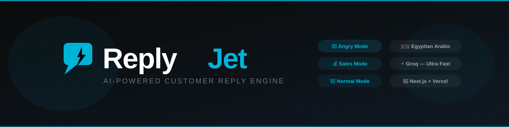

<div align="center">



<br/><br/>

[](https://nextjs.org)
[](https://react.dev)
[](https://groq.com)
[](https://vercel.com)
[](LICENSE)
[](https://github.com/SamoTech/ReplyJet/releases)
[](CONTRIBUTING.md)
[](https://developer.mozilla.org/en-US/docs/Web/JavaScript)

<br/>

**AI-powered customer reply generator — Arabic & English, built for speed and real business outcomes.**

*Turn conversations into conversions.*

</div>

---

## What is ReplyJet?

ReplyJet detects the intent behind every customer message and generates a short, human, Egyptian-Arabic (or English) reply — instantly. No fluff. No robotic phrasing.

| Intent | Trigger signals | What happens |
|--------|----------------|-------------- |
| 😤 Angry / Complaint | زعلان، غلط، هشتكي، angry, complaint, refund | Structured apology → action → order request |
| 💰 Sales / Close Sale | بكام، سعر، متاح، price, how much, available | Price/availability first → value → CTA |
| 📩 Follow Up | manual mode | Warm re-engagement → soft CTA |
| 💬 Normal | anything else | Direct, short answer |

---

## Features

- **Intent detection** — auto-detects angry / sales / normal from message content
- **Mode selector** — override intent manually: `Auto / Complaint / Close Sale / Follow Up`
- **Structured Egyptian Arabic** — sounds like a real human, not a chatbot
- **Multiple tones** — professional, friendly, sales
- **Bilingual** — Arabic (Egyptian dialect) + English
- **Copy button** — one-click reply copy with 2s confirmation
- **Regenerate button** — get a new reply without clearing the current one
- **Intent badge** — shows detected intent on every reply
- **RTL layout** — Arabic replies render right-to-left automatically
- **History** — last 50 replies saved locally with intent + mode
- **Settings** — default tone, language, and max tokens
- **Keyboard shortcut** — `Ctrl+Enter` to generate

---

## Tech Stack

| Layer | Technology | Version |
|-------|-----------|--------|
| Framework | Next.js (App Router) | 14.2.3 |
| UI | React | 18.2.0 |
| AI Provider | Groq API | `llama-3.1-8b-instant` |
| Deployment | Vercel | — |
| Language | JavaScript | ES2024 |

---

## Getting Started

```bash
git clone https://github.com/SamoTech/ReplyJet.git
cd ReplyJet
npm install
```

Create `.env.local`:

```bash
cp .env.example .env.local
# Add your GROQ_API_KEY
```

Get a free key at [console.groq.com](https://console.groq.com).

```bash
npm run dev
# → http://localhost:3000
```

---

## Project Structure

```
ReplyJet/
├── app/
│   ├── page.js               # Main UI — textarea, mode, tone, language, reply card
│   ├── layout.js             # Root layout
│   ├── history/page.js       # Reply history (last 50)
│   ├── settings/page.js      # User preferences
│   ├── about/page.js         # About page
│   └── api/
│       └── generate/
│           └── route.js      # Intent engine + mode override + prompt builder + Groq API
├── components/
│   └── NavBar.js             # Top navigation bar
├── lib/
│   └── tokens.js             # Design tokens, constants (TONES, LANGUAGES, MODES, INTENTS)
├── public/
│   ├── banner.svg
│   ├── logo.svg
│   └── favicon.svg
├── .env.example
├── CONTRIBUTING.md
├── CHANGELOG.md
├── SECURITY.md
└── LICENSE
```

---

## How It Works

```
User input + Mode selection
   ↓
Mode === "auto"?
   ├── YES → detectUserIntent()   — keyword scan → angry | sales | normal
   └── NO  → use mode directly    — complaint | close_sale | follow_up
   ↓
buildSystemPrompt()    — structured prompt per intent + language + tone
   ↓
Groq API  (llama-3.1-8b-instant, temp=0.3, max_tokens=60–400)
   ↓
{ reply, tone, language, intent, mode } → UI → History
```

---

## API Reference

**`POST /api/generate`**

**Request body:**

```json
{
  "message": "انا هاجي اكسر المطعم",
  "tone": "professional",
  "language": "Arabic",
  "mode": "auto"
}
```

| Field | Type | Values |
|-------|------|--------|
| `message` | string | Any customer message (max 1000 chars) |
| `tone` | string | `professional` \| `friendly` \| `sales` |
| `language` | string | `Arabic` \| `English` |
| `mode` | string | `auto` \| `complaint` \| `close_sale` \| `follow_up` |
| `maxTokens` | number | `60–400` (optional, default 180) |

**Response:**

```json
{
  "success": true,
  "data": {
    "reply": "حقك علينا على اللي حصل، وآسفين جدًا على الإزعاج. خلينا نحل الموضوع فورًا — ممكن تبعتلنا رقم الطلب؟",
    "tone": "professional",
    "language": "Arabic",
    "intent": "angry",
    "mode": "auto"
  }
}
```

**Error responses:**

| Status | Meaning |
|--------|---------|
| 400 | Missing or invalid input |
| 500 | Missing API key |
| 502 | Groq API failure |

---

## Test Cases

| # | Input | Mode | Expected Intent | Expected structure |
|---|-------|------|----------------|-------------------|
| 1 | `انا هاجي اكسر المطعم` | auto | angry | Starts with حقك علينا / معلش |
| 2 | `بكام المنتج؟` | auto | sales | Price first → value → CTA |
| 3 | `في توصيل؟` | auto | normal | Direct short answer |
| 4 | `عايز اعرف اكتر` | close_sale | close_sale | Value highlight → CTA |
| 5 | `تمام شكرا` | follow_up | follow_up | Warm re-engagement → soft CTA |

---

## Roadmap

- [x] Smart reply generator — Phase 1 (v1.0.0)
- [x] Regenerate button, History, Settings, Keyboard shortcut — Phase 1.1 (v1.1.0)
- [x] Mode selector: complaint / close_sale / follow_up — Phase 2 (v1.2.0)
- [ ] Templates library + saved replies — Phase 3 (v1.3.0)
- [ ] Chrome extension + WhatsApp / Facebook integration — Phase 4 (v2.0.0)

---

## Pricing

| Plan | Includes | Target |
|------|----------|--------|
| **Free** | Limited replies/day | Individuals |
| **Pro** | Unlimited replies, advanced modes, templates | Small businesses |
| **Agency** | Team usage, priority support | Agencies & enterprises |

---

## Contributing

See [CONTRIBUTING.md](CONTRIBUTING.md) for guidelines, branching strategy, and PR rules.

---

## Changelog

See [CHANGELOG.md](CHANGELOG.md) for version history.

---

## Security

See [SECURITY.md](SECURITY.md) for vulnerability reporting.

---

## License

ReplyJet is proprietary software. All rights reserved © 2026 SamoTech.

See [LICENSE](LICENSE) for full terms.
